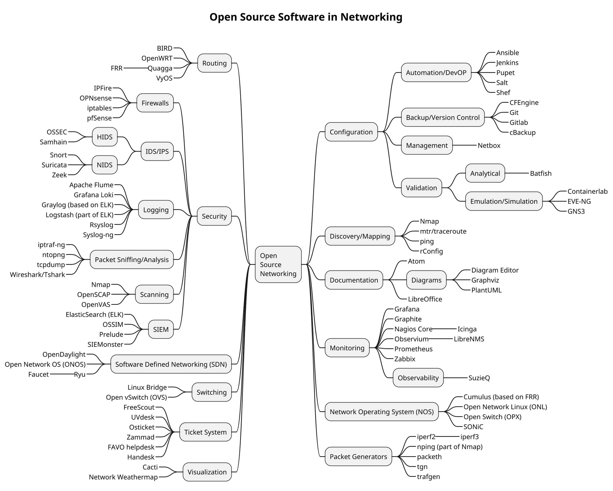

```puml {filename="netopensource.png"}
@startmindmap
scale 2
skinparam titleFontSize 22
title Open Source Software in Networking\n

<style>
mindmapDiagram {
LineThickness 1.5
//LineColor gray
}
node {
LineThickness 1
//LineColor gray
}
</style>

* Open\nSource\nNetworking

** Configuration

*** Automation/DevOP
****_ Ansible
****_ Jenkins
****_ Pupet
****_ Salt
****_ Shef

*** Backup/Version Control
****_ CFEngine
****_ Git
****_ Gitlab
****_ cBackup

*** Management
****_ Netbox

*** Validation
**** Analytical
*****_ Batfish
**** Emulation/Simulation
*****_ Containerlab
*****_ EVE-NG
*****_ GNS3


** Discovery/Mapping
***_ Nmap
***_ mtr/traceroute
***_ ping
***_ rConfig

** Documentation
***_ Atom
*** Diagrams
****_ Diagram Editor
****_ Graphviz
****_ PlantUML
***_ LibreOffice


** Monitoring
***_ Grafana
***_ Graphite
***_ Nagios Core
****_ Icinga
***_ Observium
****_ LibreNMS
***_ Prometheus
***_ Zabbix
*** Observability
****_ SuzieQ

** Network Operating System (NOS)
***_ Cumulus (based on FRR)
***_ Open Network Linux (ONL)
***_ Open Switch (OPX)
***_ SONiC


** Packet Generators
***_ iperf2
****_ iperf3
***_ nping (part of Nmap)
***_ packeth
***_ tgn
***_ trafgen

left side

** Routing
***_ BIRD
***_ OpenWRT
***_ Quagga
****_ FRR
***_ VyOS


** Security

*** Firewalls
****_ IPFire
****_ OPNsense
****_ iptables
****_ pfSense

*** IDS/IPS
**** HIDS
*****_ OSSEC
*****_ Samhain
**** NIDS
*****_ Snort
*****_ Suricata
*****_ Zeek

*** Logging
****_ Apache Flume
****_ Grafana Loki
****_ Graylog (based on ELK)
****_ Logstash (part of ELK)
****_ Rsyslog
****_ Syslog-ng

*** Packet Sniffing/Analysis
****_ iptraf-ng
****_ ntopng
****_ tcpdump
****_ Wireshark/Tshark

*** Scanning
****_ Nmap
****_ OpenSCAP
****_ OpenVAS

*** SIEM
****_ ElasticSearch (ELK)
****_ OSSIM
****_ Prelude
****_ SIEMonster


** Software Defined Networking (SDN)
***_ OpenDaylight
***_ Open Network OS (ONOS)
***_ Ryu
****_ Faucet


** Switching
***_ Linux Bridge
***_ Open vSwitch (OVS)

** Ticket System
***_ FreeScout
***_ UVdesk
***_ Osticket
***_ Zammad
***_ FAVO helpdesk
***_ Handesk


** Visualization
***_ Cacti
***_ Network Weathermap

@endmindmap
```
